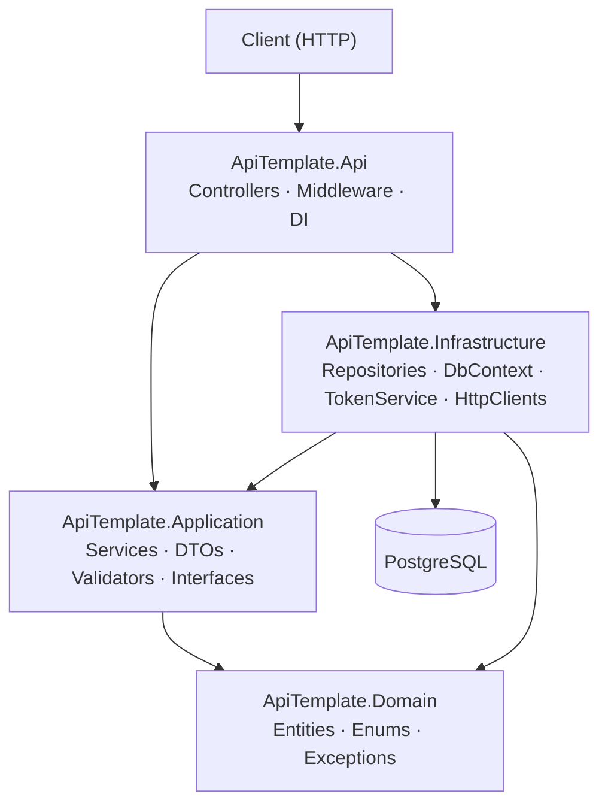
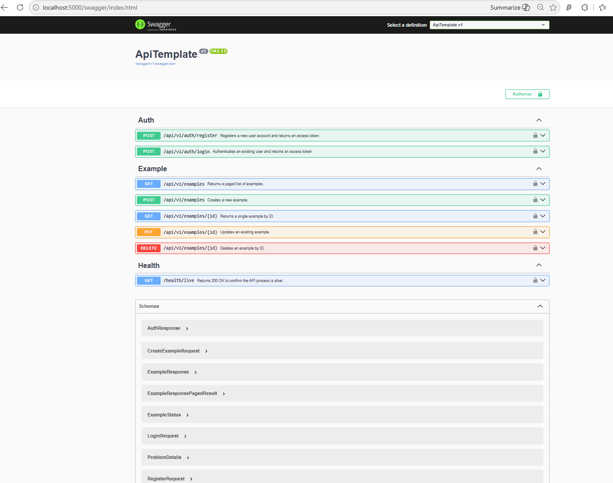

# ApiTemplate

[](https://github.com/rbsdas/dotnet-api-template/actions/workflows/ci.yml)
[](https://dotnet.microsoft.com)
[](LICENSE)

A production-ready .NET 10 Clean Architecture Lite API template. Clone it, rename `ApiTemplate` → `YourProject`, and ship.

## Architecture



## Quick Start

```bash
git clone https://github.com/rbsdas/dotnet-api-template.git
cd ApiTemplate
cp .env.example .env          # fill in DB_PASSWORD and JWT_SECRET
make docker-up                # starts API on :5000 + PostgreSQL
# open http://localhost:5000/swagger
```



## Environment Variables

| Name | Required | Default | Description |
|------|----------|---------|-------------|
| `ConnectionStrings__DefaultConnection` | Yes | — | PostgreSQL connection string |
| `Jwt__Secret` | Yes | — | HMAC-SHA256 signing key (min 32 chars) |
| `Jwt__Issuer` | No | `ApiTemplate` | JWT issuer claim |
| `Jwt__Audience` | No | `ApiTemplate` | JWT audience claim |
| `Jwt__ExpiryMinutes` | No | `60` | Access token lifetime |
| `DB_PASSWORD` | Yes (Docker) | — | PostgreSQL password (docker-compose) |
| `JWT_SECRET` | Yes (Docker) | — | JWT secret (docker-compose) |

## API Endpoints

| Method | Endpoint | Auth | Description |
|--------|----------|------|-------------|
| POST | `/api/v1/auth/register` | None | Register a new user |
| POST | `/api/v1/auth/login` | None | Authenticate and receive a token |
| GET | `/api/v1/examples` | Bearer | List examples (paged) |
| GET | `/api/v1/examples/{id}` | Bearer | Get example by ID |
| POST | `/api/v1/examples` | Bearer | Create an example |
| PUT | `/api/v1/examples/{id}` | Bearer | Update an example |
| DELETE | `/api/v1/examples/{id}` | Bearer | Delete an example |
| GET | `/health` | None | Health check |

## Project Structure

```
ApiTemplate/
├── src/
│   ├── ApiTemplate.Api/            ← Entry point, controllers, middleware
│   ├── ApiTemplate.Application/    ← Services, DTOs, validators, interfaces
│   ├── ApiTemplate.Infrastructure/ ← Repositories, DbContext, JWT, HTTP clients
│   └── ApiTemplate.Domain/         ← Entities, enums (no dependencies)
└── tests/
    ├── ApiTemplate.Unit.Tests/
    └── ApiTemplate.Integration.Tests/
```

## Development Setup

**Prerequisites:** .NET 10 SDK, Docker Desktop, `make`

```bash
# Without Docker
cp src/ApiTemplate.Api/appsettings.Development.json.example ...  # set connection string
make db-update     # apply EF migrations
make run           # start API at https://localhost:5001

# With Docker
make docker-up
```

## Database Migrations

```bash
make migrate       # creates a new migration (prompts for name)
make db-update     # applies pending migrations
make db-drop       # drops the dev database
```

## Testing

```bash
make test          # run all tests
make test-unit     # unit tests only
make test-int      # integration tests only (requires Docker)
make coverage      # generate HTML coverage report in ./coverage/report/
```

## Docker

```bash
make docker-up     # start in background
make docker-down   # stop and remove containers
make docker-build  # rebuild images
```

## Contributing

See [CONTRIBUTING.md](CONTRIBUTING.md).

## License

[MIT](LICENSE) — © 2025 [Your Name]
