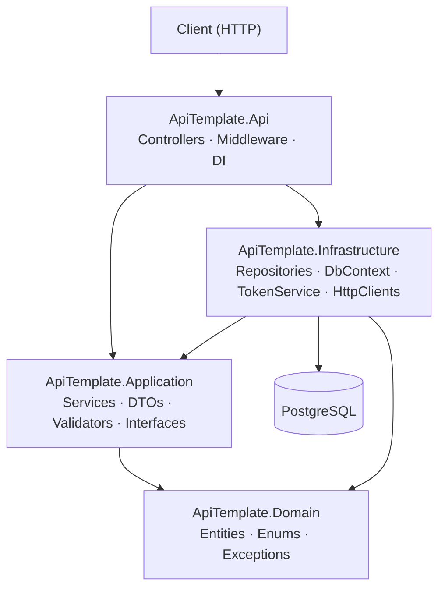

# .NET 10 Backend API Template — Generation Prompt

> Use this prompt in a fresh Claude Code session inside an empty directory to scaffold a complete, production-ready .NET 10 API template project.

---

## Context & Architecture Decision

This template is derived from analysis of two reference projects:

- **CryptoDashboardAPI** — simple layered API with controllers → services → repositories, EF Core/PostgreSQL, JWT auth, custom exception middleware, xUnit/Moq/FluentAssertions, multi-stage Docker.
- **IncidentTimeline** — multi-project layered architecture with clean separation, strongly-typed config via `IOptions<T>`, CancellationToken discipline, comprehensive parallel test projects, MongoDB, docker-compose.

### Chosen Architecture: Clean Architecture Lite (4-project solution)

Not full DDD — no aggregates, bounded contexts, or value objects. Not a single-project monolith — clear compilation boundaries enforce dependency direction. The sweet spot for a general-purpose backend template.

```
YourProject.sln
├── src/
│   ├── YourProject.Api/            ← Entry point: Program.cs, controllers, middleware, DI wiring
│   ├── YourProject.Application/    ← Services, interfaces, DTOs, validators, exceptions
│   ├── YourProject.Infrastructure/ ← Repositories, DbContext, EF migrations, typed HTTP clients
│   └── YourProject.Domain/         ← Entities, enums, domain exceptions (no dependencies)
└── tests/
    ├── YourProject.Unit.Tests/      ← Unit tests with mocks (xUnit + Moq + FluentAssertions)
    └── YourProject.Integration.Tests/ ← WebApplicationFactory + Testcontainers (PostgreSQL)
```

**Dependency rule:** Api → Application ← Infrastructure; Domain has zero dependencies.

---

## Task: Scaffold the Full Template

You are building a reusable .NET 10 API template. The placeholder name throughout is `ApiTemplate` — users will find-and-replace it. Every file must be complete and production-quality. Do not leave `// TODO` stubs unless explicitly noted.

### Ground Rules

1. **Target: .NET 10**, `<LangVersion>latest</LangVersion>`, `<Nullable>enable</Nullable>`, `<ImplicitUsings>enable</ImplicitUsings>`, `<TreatWarningsAsErrors>true</TreatWarningsAsErrors>`.
2. **No over-engineering.** No MediatR, no AutoMapper, no Scrutor, no event sourcing. Manual DI registration via extension methods in each project. Simple is right.
3. **Every public API surface has XML doc comments** (`/// <summary>`).
4. **CancellationToken** threaded through all async service and repository methods.
5. **Strongly-typed configuration** everywhere via `IOptions<T>` — no raw `IConfiguration` access in services.
6. **Problem Details (RFC 7807)** for all error responses.
7. **Serilog** for structured logging (not Microsoft.Extensions.Logging alone).
8. **FluentValidation** for all request/command validation.
9. Use **`global using`** directives in a `GlobalUsings.cs` per project.

---

## Step 1 — Solution & Project Scaffolding

Create the following directory and file structure. Generate every file's content completely.

```
ApiTemplate/
├── src/
│   ├── ApiTemplate.Api/
│   │   ├── ApiTemplate.Api.csproj
│   │   ├── Program.cs
│   │   ├── GlobalUsings.cs
│   │   ├── Controllers/
│   │   │   ├── V1/
│   │   │   │   ├── ExampleController.cs
│   │   │   │   └── AuthController.cs
│   │   │   └── HealthController.cs
│   │   ├── Middleware/
│   │   │   ├── GlobalExceptionMiddleware.cs
│   │   │   ├── CorrelationIdMiddleware.cs
│   │   │   └── RequestLoggingMiddleware.cs
│   │   ├── Extensions/
│   │   │   ├── ServiceCollectionExtensions.cs   ← registers Api-layer services
│   │   │   └── WebApplicationExtensions.cs      ← configures middleware pipeline
│   │   ├── appsettings.json
│   │   ├── appsettings.Development.json
│   │   └── appsettings.Production.json
│   │
│   ├── ApiTemplate.Application/
│   │   ├── ApiTemplate.Application.csproj
│   │   ├── GlobalUsings.cs
│   │   ├── Common/
│   │   │   ├── Interfaces/
│   │   │   │   ├── IExampleRepository.cs
│   │   │   │   └── ICurrentUserService.cs
│   │   │   ├── Models/
│   │   │   │   └── PagedResult.cs
│   │   │   └── Exceptions/
│   │   │       ├── NotFoundException.cs
│   │   │       ├── ConflictException.cs
│   │   │       ├── ForbiddenException.cs
│   │   │       └── DomainValidationException.cs
│   │   ├── Examples/
│   │   │   ├── ExampleService.cs
│   │   │   ├── IExampleService.cs
│   │   │   ├── Dtos/
│   │   │   │   ├── CreateExampleRequest.cs
│   │   │   │   ├── UpdateExampleRequest.cs
│   │   │   │   └── ExampleResponse.cs
│   │   │   └── Validators/
│   │   │       ├── CreateExampleRequestValidator.cs
│   │   │       └── UpdateExampleRequestValidator.cs
│   │   ├── Auth/
│   │   │   ├── ITokenService.cs
│   │   │   ├── Dtos/
│   │   │   │   ├── LoginRequest.cs
│   │   │   │   ├── RegisterRequest.cs
│   │   │   │   └── AuthResponse.cs
│   │   │   └── Validators/
│   │   │       ├── LoginRequestValidator.cs
│   │   │       └── RegisterRequestValidator.cs
│   │   └── Extensions/
│   │       └── ServiceCollectionExtensions.cs   ← registers Application services + validators
│   │
│   ├── ApiTemplate.Infrastructure/
│   │   ├── ApiTemplate.Infrastructure.csproj
│   │   ├── GlobalUsings.cs
│   │   ├── Persistence/
│   │   │   ├── AppDbContext.cs
│   │   │   ├── Configurations/
│   │   │   │   └── ExampleEntityConfiguration.cs
│   │   │   ├── Migrations/            ← (empty; EF tooling generates these)
│   │   │   ├── Repositories/
│   │   │   │   └── ExampleRepository.cs
│   │   │   └── Interceptors/
│   │   │       └── AuditableEntityInterceptor.cs
│   │   ├── Identity/
│   │   │   ├── TokenService.cs
│   │   │   └── CurrentUserService.cs
│   │   ├── ExternalClients/
│   │   │   └── ExampleHttpClient/
│   │   │       ├── IExampleHttpClient.cs
│   │   │       ├── ExampleHttpClient.cs
│   │   │       └── Dtos/
│   │   │           └── ExampleApiResponse.cs
│   │   └── Extensions/
│   │       └── ServiceCollectionExtensions.cs   ← registers Infrastructure services
│   │
│   └── ApiTemplate.Domain/
│       ├── ApiTemplate.Domain.csproj
│       ├── GlobalUsings.cs
│       ├── Entities/
│       │   ├── BaseEntity.cs
│       │   ├── AuditableEntity.cs
│       │   ├── Example.cs
│       │   └── AppUser.cs
│       └── Enums/
│           └── ExampleStatus.cs
│
├── tests/
│   ├── ApiTemplate.Unit.Tests/
│   │   ├── ApiTemplate.Unit.Tests.csproj
│   │   ├── GlobalUsings.cs
│   │   ├── Examples/
│   │   │   └── ExampleServiceTests.cs
│   │   ├── Auth/
│   │   │   └── TokenServiceTests.cs
│   │   └── Middleware/
│   │       └── GlobalExceptionMiddlewareTests.cs
│   │
│   └── ApiTemplate.Integration.Tests/
│       ├── ApiTemplate.Integration.Tests.csproj
│       ├── GlobalUsings.cs
│       ├── Infrastructure/
│       │   ├── ApiTestFixture.cs           ← WebApplicationFactory + Testcontainers
│       │   └── DatabaseSeeder.cs
│       └── Controllers/
│           ├── ExamplesControllerTests.cs
│           └── AuthControllerTests.cs
│
├── .github/
│   ├── workflows/
│   │   ├── ci.yml                     ← build + test on PR and push to main
│   │   └── release.yml                ← create GitHub release on tag
│   ├── ISSUE_TEMPLATE/
│   │   ├── bug_report.md
│   │   └── feature_request.md
│   └── PULL_REQUEST_TEMPLATE.md
│
├── Dockerfile
├── docker-compose.yml
├── docker-compose.override.yml        ← dev overrides (ports, volumes, hot reload)
├── .env.example
├── .editorconfig
├── .globalconfig
├── .gitignore                         ← .NET-specific gitignore
├── Makefile
├── ApiTemplate.sln
├── Directory.Build.props              ← shared MSBuild properties for all projects
├── Directory.Packages.props           ← centralized NuGet version management
├── CLAUDE.md
├── README.md
├── CONTRIBUTING.md
├── CHANGELOG.md
├── SECURITY.md
├── LICENSE                            ← MIT
├── scripts/
│   ├── rename-template.ps1            ← Windows rename script (project name)
│   ├── rename-template.sh             ← Mac/Linux rename script (project name)
│   ├── rename-entity.ps1              ← Windows rename script (example entity)
│   └── rename-entity.sh               ← Mac/Linux rename script (example entity)
└── docs/
    └── screenshots/
        └── .gitkeep                   ← placeholder; README references docs/screenshots/swagger.png
```

---

## Step 2 — NuGet Packages

Use **Central Package Management** via `Directory.Packages.props`. All `<PackageReference>` in `.csproj` files omit the `Version` attribute.

### Directory.Packages.props

```xml
<Project>
  <PropertyGroup>
    <ManagePackageVersionsCentrally>true</ManagePackageVersionsCentrally>
  </PropertyGroup>
  <ItemGroup>
    <!-- API -->
    <PackageVersion Include="Serilog.AspNetCore" Version="9.0.0" />
    <PackageVersion Include="Serilog.Sinks.Console" Version="6.0.0" />
    <PackageVersion Include="Serilog.Sinks.File" Version="6.0.0" />
    <PackageVersion Include="Serilog.Enrichers.Environment" Version="3.0.1" />
    <PackageVersion Include="Serilog.Enrichers.Thread" Version="4.0.0" />
    <PackageVersion Include="Serilog.Enrichers.Process" Version="3.0.0" />
    <PackageVersion Include="Microsoft.AspNetCore.Authentication.JwtBearer" Version="10.0.0" />
    <PackageVersion Include="Swashbuckle.AspNetCore" Version="10.1.7" />
    <PackageVersion Include="Asp.Versioning.Http" Version="9.1.0" />
    <PackageVersion Include="Asp.Versioning.Mvc.ApiExplorer" Version="9.1.0" />
    <!-- Application -->
    <PackageVersion Include="FluentValidation" Version="11.9.0" />
    <PackageVersion Include="FluentValidation.DependencyInjectionExtensions" Version="11.9.0" />
    <PackageVersion Include="Microsoft.Extensions.Options" Version="10.0.0" />
    <!-- Infrastructure -->
    <PackageVersion Include="Microsoft.EntityFrameworkCore" Version="10.0.0" />
    <PackageVersion Include="Microsoft.EntityFrameworkCore.Design" Version="10.0.0" />
    <PackageVersion Include="Npgsql.EntityFrameworkCore.PostgreSQL" Version="10.0.0" />
    <PackageVersion Include="BCrypt.Net-Next" Version="4.0.3" />
    <PackageVersion Include="Polly" Version="8.6.1" />
    <PackageVersion Include="Microsoft.Extensions.Http.Polly" Version="10.0.0" />
    <!-- Tests -->
    <PackageVersion Include="xunit" Version="2.9.3" />
    <PackageVersion Include="xunit.runner.visualstudio" Version="3.1.4" />
    <PackageVersion Include="Microsoft.NET.Test.Sdk" Version="17.14.1" />
    <PackageVersion Include="Moq" Version="4.20.72" />
    <PackageVersion Include="FluentAssertions" Version="8.9.0" />
    <PackageVersion Include="coverlet.collector" Version="6.0.4" />
    <PackageVersion Include="Microsoft.AspNetCore.Mvc.Testing" Version="10.0.0" />
    <PackageVersion Include="Testcontainers.PostgreSql" Version="4.4.0" />
  </ItemGroup>
</Project>
```

### Directory.Build.props

```xml
<Project>
  <PropertyGroup>
    <TargetFramework>net10.0</TargetFramework>
    <Nullable>enable</Nullable>
    <ImplicitUsings>enable</ImplicitUsings>
    <LangVersion>latest</LangVersion>
    <TreatWarningsAsErrors>true</TreatWarningsAsErrors>
    <GenerateDocumentationFile>true</GenerateDocumentationFile>
    <NoWarn>CS1591</NoWarn>  <!-- suppress missing XML doc on non-public members -->
    <AnalysisLevel>latest-recommended</AnalysisLevel>
  </PropertyGroup>
</Project>
```

---

## Step 3 — Key Implementation Details

Implement every file completely. The following sections define the expected behavior of critical files.

### Program.cs

```
- Use top-level statements
- Serilog bootstrap (two-stage: early catch for startup failures)
- Call each layer's ServiceCollectionExtensions: AddDomainServices, AddApplicationServices, AddInfrastructureServices, AddApiServices
- Middleware pipeline order:
  1. app.UseCorrelationId()       ← sets X-Correlation-ID header
  2. app.UseSerilogRequestLogging()
  3. app.UseExceptionHandler()    ← global exception handler (UseMiddleware<GlobalExceptionMiddleware>)
  4. app.UseHttpsRedirection()
  5. app.UseRateLimiter()
  6. app.UseCors()
  7. app.UseAuthentication()
  8. app.UseAuthorization()
  9. app.MapControllers()
  10. app.MapHealthChecks("/health")
- Run EF Core pending migrations on startup (using IServiceScope), log migration count
- Graceful shutdown via app.Lifetime.ApplicationStopping
```

### appsettings.json (with all sections, sensible defaults)

```json
{
  "Serilog": {
    "Using": ["Serilog.Sinks.Console", "Serilog.Sinks.File"],
    "MinimumLevel": {
      "Default": "Information",
      "Override": {
        "Microsoft.AspNetCore": "Warning",
        "Microsoft.EntityFrameworkCore.Database.Command": "Warning"
      }
    },
    "WriteTo": [
      { "Name": "Console", "Args": { "outputTemplate": "[{Timestamp:HH:mm:ss} {Level:u3}] {CorrelationId} {Message:lj}{NewLine}{Exception}" } },
      { "Name": "File", "Args": { "path": "logs/api-.log", "rollingInterval": "Day", "retainedFileCountLimit": 7 } }
    ],
    "Enrich": ["FromLogContext", "WithMachineName", "WithThreadId", "WithProcessId"]
  },
  "ConnectionStrings": {
    "DefaultConnection": ""
  },
  "Jwt": {
    "Secret": "",
    "Issuer": "ApiTemplate",
    "Audience": "ApiTemplate",
    "ExpiryMinutes": 60,
    "RefreshExpiryDays": 7
  },
  "Cors": {
    "AllowedOrigins": ["http://localhost:3000", "http://localhost:5173"]
  },
  "RateLimiting": {
    "PermitLimit": 100,
    "WindowSeconds": 60
  },
  "AllowedHosts": "*"
}
```

### GlobalExceptionMiddleware.cs

- Catches all unhandled exceptions
- Maps to Problem Details (RFC 7807) with `application/problem+json` content type
- Logs with correlation ID and exception details
- Maps known application exceptions:

| Exception | Status |
|-----------|--------|
| `NotFoundException` | 404 |
| `ConflictException` | 409 |
| `ForbiddenException` | 403 |
| `DomainValidationException` | 422 (include errors dict in extensions) |
| `UnauthorizedAccessException` | 401 |
| Any other | 500 (no stack trace in response body) |

### CorrelationIdMiddleware.cs

- Reads `X-Correlation-ID` from request headers; generates `Guid.NewGuid()` if absent
- Pushes to `LogContext.PushProperty("CorrelationId", id)`
- Adds to response headers
- Stores in `HttpContext.Items["CorrelationId"]`

### Domain Entities

```csharp
// BaseEntity.cs
public abstract class BaseEntity
{
    public Guid Id { get; protected set; } = Guid.NewGuid();
}

// AuditableEntity.cs
public abstract class AuditableEntity : BaseEntity
{
    public DateTime CreatedAt { get; set; }
    public DateTime UpdatedAt { get; set; }
}

// AppUser.cs — Id, Email, PasswordHash, CreatedAt, UpdatedAt
// Example.cs — Id, Title, Description, Status (enum), CreatedAt, UpdatedAt, CreatedByUserId
```

### AppDbContext.cs

- Inherits `DbContext`
- `DbSet<AppUser>`, `DbSet<Example>`
- `OnModelCreating` calls `modelBuilder.ApplyConfigurationsFromAssembly(...)`
- Overrides `SaveChangesAsync` to call `AuditableEntityInterceptor` for setting timestamps
- UTC enforcement: override `SaveChanges`/`SaveChangesAsync` to normalize all `DateTime` to UTC

### AuditableEntityInterceptor.cs

EF Core `SaveChangesInterceptor` that sets `CreatedAt` / `UpdatedAt` on `AuditableEntity` entries.

### Repository Pattern

```csharp
// IExampleRepository.cs (in Application)
public interface IExampleRepository
{
    Task<Example?> GetByIdAsync(Guid id, CancellationToken cancellationToken = default);
    Task<PagedResult<Example>> GetPagedAsync(int page, int pageSize, CancellationToken cancellationToken = default);
    Task<Example> CreateAsync(Example example, CancellationToken cancellationToken = default);
    Task<Example> UpdateAsync(Example example, CancellationToken cancellationToken = default);
    Task DeleteAsync(Guid id, CancellationToken cancellationToken = default);
}
```

### ExampleService.cs

- Implement full CRUD via `IExampleRepository`
- Use FluentValidation (inject validators or use `IValidator<T>`)
- Throw domain exceptions (not return nulls or booleans)
- Map between domain entities and DTOs internally (manual mapping — no AutoMapper)
- Accept `CancellationToken` on all methods

### JWT Authentication

```csharp
// JwtOptions.cs (in Application or Infrastructure)
public class JwtOptions
{
    public const string SectionName = "Jwt";
    public string Secret { get; init; } = string.Empty;
    public string Issuer { get; init; } = string.Empty;
    public string Audience { get; init; } = string.Empty;
    public int ExpiryMinutes { get; init; } = 60;
    public int RefreshExpiryDays { get; init; } = 7;
}
```

- `TokenService` generates JWT tokens with claims: `sub` (user ID), `email`, `jti`, `iat`
- `ClockSkew = TimeSpan.Zero`
- `ValidateLifetime = true`

### API Versioning

- Use `Asp.Versioning.Http` with URL segment versioning (`/api/v{version}/`)
- Register with `builder.Services.AddApiVersioning(o => { o.DefaultApiVersion = new ApiVersion(1); o.AssumeDefaultVersionWhenUnspecified = true; })`
- Controllers use `[ApiVersion(1)]` and route `[Route("api/v{version:apiVersion}/examples")]`
- Swagger configured to show version selector

### Health Checks

```csharp
builder.Services.AddHealthChecks()
    .AddDbContextCheck<AppDbContext>("database")
    .AddCheck("self", () => HealthCheckResult.Healthy());

app.MapHealthChecks("/health", new HealthCheckOptions
{
    ResponseWriter = UIResponseWriter.WriteHealthCheckUIResponse
});
```

### Rate Limiting

Use .NET 8+ built-in `Microsoft.AspNetCore.RateLimiting`:
- Fixed window limiter with `RateLimitingOptions` read from `IOptions<RateLimitingOptions>`
- Apply globally via `app.UseRateLimiter()`

### CORS

```csharp
builder.Services.AddCors(options =>
    options.AddDefaultPolicy(policy =>
        policy.WithOrigins(corsOptions.AllowedOrigins)
              .AllowAnyMethod()
              .AllowAnyHeader()));
```

### Typed HTTP Client (External API Example)

```csharp
// ExampleHttpClient.cs — wraps a placeholder external API
// Registered with Polly retry (3 retries, exponential backoff)
// Uses IOptions<ExampleApiOptions> for base URL and API key
// Implement: GetAsync, PostAsync with typed request/response DTOs
```

### DI Extension Methods

Each project exposes a single `AddXxxServices(this IServiceCollection services, IConfiguration configuration)` extension method. Program.cs calls each in order:

```csharp
builder.Services
    .AddApplicationServices()
    .AddInfrastructureServices(builder.Configuration)
    .AddApiServices(builder.Configuration);
```

---

## Step 4 — Test Projects

### Unit Tests (ApiTemplate.Unit.Tests)

**ExampleServiceTests.cs** — test all CRUD operations with mocked `IExampleRepository`:
- `GetById_WhenExists_ReturnsDto`
- `GetById_WhenNotFound_ThrowsNotFoundException`
- `Create_WithValidRequest_ReturnsCreatedDto`
- `Create_WithDuplicateTitle_ThrowsConflictException`
- `Update_WhenNotFound_ThrowsNotFoundException`
- `Delete_WhenNotFound_ThrowsNotFoundException`

**TokenServiceTests.cs** — token generation and validation:
- `GenerateToken_ReturnsValidJwt`
- `GenerateToken_ContainsCorrectClaims`
- `ValidateToken_WithExpiredToken_ReturnsNull` (or throws)

**GlobalExceptionMiddlewareTests.cs** — exception-to-status mapping:
- `[Theory]` over all mapped exception types
- `UnhandledException_Returns500_WithoutStackTrace`
- `Response_ContentType_IsApplicationProblemJson`

### Integration Tests (ApiTemplate.Integration.Tests)

**ApiTestFixture.cs:**
- Extends `WebApplicationFactory<Program>`
- Uses `Testcontainers.PostgreSql` to spin up real PostgreSQL
- Overrides `ConnectionStrings:DefaultConnection` via `IConfiguration`
- Runs EF migrations before tests
- Provides authenticated and unauthenticated `HttpClient` helpers

**ExamplesControllerTests.cs** — happy path + validation:
- `GET /api/v1/examples` — returns 200 with paged list
- `GET /api/v1/examples/{id}` — returns 200 or 404
- `POST /api/v1/examples` — returns 201 with Location header
- `POST /api/v1/examples` with invalid body — returns 422 with errors
- `DELETE /api/v1/examples/{id}` without auth — returns 401

---

## Step 5 — Infrastructure Files

### Dockerfile (multi-stage)

```dockerfile
FROM mcr.microsoft.com/dotnet/sdk:10.0 AS build
WORKDIR /repo

# Copy solution and project files first (better layer caching)
COPY ApiTemplate.sln Directory.Build.props Directory.Packages.props ./
COPY src/ApiTemplate.Api/ApiTemplate.Api.csproj src/ApiTemplate.Api/
COPY src/ApiTemplate.Application/ApiTemplate.Application.csproj src/ApiTemplate.Application/
COPY src/ApiTemplate.Infrastructure/ApiTemplate.Infrastructure.csproj src/ApiTemplate.Infrastructure/
COPY src/ApiTemplate.Domain/ApiTemplate.Domain.csproj src/ApiTemplate.Domain/
RUN dotnet restore src/ApiTemplate.Api/ApiTemplate.Api.csproj

COPY src/ src/
RUN dotnet publish src/ApiTemplate.Api/ApiTemplate.Api.csproj \
    -c Release -o /app/publish --no-restore

FROM mcr.microsoft.com/dotnet/aspnet:10.0 AS runtime
WORKDIR /app
COPY --from=build /app/publish .
EXPOSE 8080
ENV ASPNETCORE_URLS=http://+:8080
ENV ASPNETCORE_ENVIRONMENT=Production
ENTRYPOINT ["dotnet", "ApiTemplate.Api.dll"]
```

### docker-compose.yml

```yaml
services:
  api:
    build: .
    ports: ["5000:8080"]
    environment:
      - ConnectionStrings__DefaultConnection=Host=db;Port=5432;Database=apitemplate;Username=postgres;Password=${DB_PASSWORD}
      - Jwt__Secret=${JWT_SECRET}
      - ASPNETCORE_ENVIRONMENT=Production
    depends_on:
      db:
        condition: service_healthy

  db:
    image: postgres:17-alpine
    environment:
      POSTGRES_DB: apitemplate
      POSTGRES_USER: postgres
      POSTGRES_PASSWORD: ${DB_PASSWORD}
    ports: ["5432:5432"]
    volumes: [pgdata:/var/lib/postgresql/data]
    healthcheck:
      test: ["CMD-SHELL", "pg_isready -U postgres"]
      interval: 5s
      timeout: 5s
      retries: 5

volumes:
  pgdata:
```

### docker-compose.override.yml (dev)

```yaml
services:
  api:
    build:
      args:
        - BUILD_CONFIGURATION=Debug
    environment:
      - ASPNETCORE_ENVIRONMENT=Development
      - ASPNETCORE_URLS=http://+:8080
# NOTE: Hot reload does not work inside Docker for compiled .NET apps.
# For hot reload during local development, run the API outside Docker:
#   make watch        (uses dotnet watch)
#   make docker-up    (starts PostgreSQL only — see docker-compose.db-only.yml)
# The override file exists to set the Development environment and debug build config.
```

### .env.example

```
DB_PASSWORD=your_secure_password_here
JWT_SECRET=your_256_bit_secret_here_at_least_32_chars
ASPNETCORE_ENVIRONMENT=Development
```

### Makefile

Provide targets:
```makefile
# make help — lists all targets with descriptions
build        → dotnet build
test         → dotnet test (both test projects)
test-unit    → unit tests only
test-int     → integration tests only
coverage     → dotnet test with coverlet, generates HTML report
run          → dotnet run --project src/ApiTemplate.Api
watch        → dotnet watch --project src/ApiTemplate.Api
migrate      → dotnet ef migrations add (prompts for name)
db-update    → dotnet ef database update
db-drop      → dotnet ef database drop
docker-up    → docker compose up -d
docker-down  → docker compose down
docker-build → docker compose build
clean        → dotnet clean + remove bin/obj recursively
format       → dotnet format
restore      → dotnet restore
```

### scripts/rename-template.ps1 (Windows) and scripts/rename-template.sh (Mac/Linux)

These scripts let a developer rename the entire template in one command.

**scripts/rename-template.ps1:**
```
Accepts one mandatory parameter: -NewName (e.g. "TaskManagerApi")
Validates the new name is PascalCase (regex: ^[A-Z][a-zA-Z0-9]+$); exits with error if not.
Steps:
  1. Verify script is run from the repo root (ApiTemplate.sln must exist).
  2. Rename all directories whose name contains "ApiTemplate" — deepest first to avoid path conflicts.
  3. Replace all occurrences of "ApiTemplate" in all file contents (all extensions).
  4. Rename all files whose name contains "ApiTemplate".
  5. Print a summary: N directories renamed, N files renamed, N files with content updated.
  6. Print next steps: copy .env.example → .env, then run make docker-up.
```

**scripts/rename-template.sh:**
```
Same logic as the PowerShell script, implemented in bash.
Uses sed for in-place content replacement (BSD sed on Mac requires -i ''; GNU sed on Linux uses -i).
Detect OS via uname and use the correct sed flag automatically.
Make the script executable (chmod +x) in the generation step.
```

Both scripts must be generated as complete, runnable files — not pseudocode.

---

### scripts/rename-entity.ps1 (Windows) and scripts/rename-entity.sh (Mac/Linux)

These scripts replace the `Example` placeholder entity with the developer's first real domain entity. Run after `rename-template` once you know your first entity name.

**Behaviour — 4 simultaneous replacements:**

The script accepts one mandatory parameter: `-EntityName` (PascalCase singular, e.g. `StockPrice`).
It derives all four forms automatically:

| Form | Derived from | Example input → output |
|---|---|---|
| PascalCase singular | Input as-is | `StockPrice` |
| PascalCase plural | Append `s` (see note) | `StockPrices` |
| camelCase singular | Lowercase first char | `stockPrice` |
| camelCase plural | Lowercase first char of plural | `stockPrices` |

It then replaces all four forms of `Example`/`Examples`/`example`/`examples` with their counterparts throughout all file contents and file/directory names, in the correct order (longest match first to avoid partial replacements).

**Route string handling:**
After replacement, the script scans all `[Route(...)]` attributes for the plural camelCase form (e.g. `stockPrices`) and prints a warning:
```
WARNING: Route strings updated to 'stockPrices'. REST convention for multi-word
resources is kebab-case ('stock-prices'). Review Controllers/V1/ and update manually if needed.
```
The script does NOT silently convert to kebab-case — it leaves the decision to the developer.

**Plural derivation note:**
Naive pluralisation (append `s`) covers most cases but not all. Before applying, print the derived plural and prompt:
```
Derived plural: 'StockPrices'. Accept? (Y/n):
```
If the developer enters a custom plural (e.g. `Indices` for `Index`), use that instead.

**Validation:**
- Validate `-EntityName` is PascalCase: `^[A-Z][a-zA-Z0-9]+$`
- Refuse to run if `Example` no longer exists in the codebase (rename already done or wrong directory)
- Refuse to run before `rename-template` has been run (check: `ApiTemplate` must not exist in any filename)

**scripts/rename-entity.sh:**
Same logic in bash. Detect OS via `uname` for correct `sed -i` flag (BSD vs GNU).
Make executable (`chmod +x`) in the generation step.

**Summary output on completion:**
```
✔ Entity renamed: Example → StockPrice
  Files renamed:     12
  Directories:        2
  Content updated:   38 files

Next step: run 'make migrate Name=InitialStockPrice' to create your first migration.
```

Both scripts must be generated as complete, runnable files — not pseudocode.

---

### .editorconfig

Standard .NET/C# editorconfig:
- `indent_size = 4`, `indent_style = space`
- Enforce `var` usage (`csharp_style_var_for_built_in_types = true:suggestion`)
- Enforce expression-bodied members where appropriate
- `dotnet_sort_system_directives_first = true`
- `dotnet_separate_import_directive_groups = false`
- Full C# naming convention rules (interfaces prefix `I`, async methods suffix `Async`, etc.)

### .globalconfig

```editorconfig
is_global = true
global_level = 100

# Enforce consistent style across all projects in the solution
dotnet_diagnostic.CA1031.severity = suggestion  # catch specific exceptions
dotnet_diagnostic.CA2007.severity = none         # ConfigureAwait not required in ASP.NET Core
dotnet_diagnostic.CA1062.severity = suggestion   # validate parameters
```

### .gitignore

Full .NET .gitignore (Visual Studio template) plus:
```
.env
.env.local
logs/
*.user
```

---

## Step 6 — GitHub Actions Workflows

### .github/workflows/ci.yml

Trigger: `push` to `main`, `pull_request` to `main`.

Jobs:
1. **build-and-test**
   - `ubuntu-latest`
   - Steps: checkout → setup .NET 10 → restore → build `--no-restore` → test with coverage → upload coverage artifact
   - Service container: PostgreSQL 17 (for integration tests)
   - Set env vars for integration test connection string from service container

2. **code-quality**
   - `dotnet format --verify-no-changes`

### .github/workflows/release.yml

Trigger: `push` tags matching `v*.*.*`.

Steps: checkout → build → publish → create GitHub Release with changelog excerpt.

### Issue Templates

**bug_report.md:** Sections: Describe the bug, Steps to reproduce, Expected behavior, Environment (OS, .NET version, Docker version).

**feature_request.md:** Sections: Is your feature request related to a problem? Describe the solution. Alternatives considered.

### PR Template (.github/PULL_REQUEST_TEMPLATE.md)

```markdown
## Summary
<!-- What does this PR do? -->

## Type of Change
- [ ] Bug fix
- [ ] New feature
- [ ] Breaking change
- [ ] Documentation update

## Testing
- [ ] Unit tests added/updated
- [ ] Integration tests added/updated
- [ ] Manual testing performed

## Checklist
- [ ] Code follows project conventions (editorconfig, no warnings)
- [ ] Documentation updated (README, CHANGELOG)
- [ ] No secrets committed
```

---

## Step 7 — Documentation Files

### CLAUDE.md

This file instructs Claude Code how to work with this repository. Include:

```markdown
# CLAUDE.md — Working with ApiTemplate in Claude Code

## Project Overview
ApiTemplate is a .NET 10 Clean Architecture Lite API template. Four source projects: Domain → Application ← Infrastructure ← Api.

## Architecture Rules (non-negotiable)
1. Domain has ZERO external dependencies — no NuGet packages, no project references beyond System.*.
2. Application references only Domain. Never references Infrastructure.
3. Infrastructure references Application and Domain.
4. Api references all layers (wiring only — no business logic in Program.cs or Controllers).

## Code Conventions
- All async methods must accept `CancellationToken ct = default` as last parameter.
- All configuration access goes through `IOptions<T>` — never inject `IConfiguration` directly into services.
- All request validation uses FluentValidation — never `ModelState.IsValid` in controllers.
- Controllers are thin: validate input, call service, return response. No business logic.
- Services throw domain exceptions (NotFoundException, ConflictException, etc.) — never return null or bool.
- All DateTime values must be UTC. Set `DateTimeKind.Utc` at system boundaries.

## Entity Naming — Avoid BCL Collisions

Never name a domain entity after a BCL or ASP.NET Core type. The following names are banned:

| Banned name         | Collides with                              | Use instead                  |
|---------------------|--------------------------------------------|------------------------------|
| Task                | System.Threading.Tasks.Task                | WorkItem, Assignment, Job    |
| Exception           | System.Exception                           | DomainEvent, Incident        |
| Thread              | System.Threading.Thread                    | Discussion, Post             |
| Timer               | System.Threading.Timer                     | Schedule, Reminder           |
| Stream              | System.IO.Stream                           | Feed, DataFlow               |
| Object              | System.Object                              | Item, Record                 |
| Event               | System.EventArgs                           | Occurrence, Incident         |
| Action              | System.Action (delegate)                   | Operation, Command           |
| Type                | System.Type                                | Category, Kind               |
| File                | System.IO.File                             | Document, Asset              |
| Path                | System.IO.Path                             | Route, Location              |
| Version             | System.Version                             | Release, Revision            |
| Process             | System.Diagnostics.Process                 | Workflow, Pipeline           |
| User                | ControllerBase.User (ClaimsPrincipal)      | AppUser, Member, Account     |
| ValidationException | FluentValidation.ValidationException       | DomainValidationException    |

Rule of thumb: if `System.` has it, or if ASP.NET Core's `ControllerBase` exposes a property with that name, rename your entity.

## Running the Project
- `make run` — starts API with hot reload
- `make docker-up` — starts API + PostgreSQL in Docker
- `make test` — runs all tests

## Database Migrations
- `make migrate` (prompts for name) — creates new migration
- `make db-update` — applies pending migrations
- Migrations auto-apply on startup (development and staging only; production requires explicit apply)

## Testing Strategy
- Unit tests: mock all dependencies with Moq; use FluentAssertions
- Integration tests: Testcontainers PostgreSQL; real HTTP stack via WebApplicationFactory
- Never mock DbContext directly — use integration tests for repository tests

## Adding a New Feature
1. Add domain entity to Domain/Entities/
2. Add repository interface to Application/Common/Interfaces/
3. Add DTOs and validators to Application/YourFeature/
4. Implement service in Application/YourFeature/
5. Implement repository in Infrastructure/Persistence/Repositories/
6. Add controller in Api/Controllers/V1/
7. Register in each layer's ServiceCollectionExtensions
8. Add unit tests + integration tests
9. Run `make migrate` to create DB migration

## Environment Variables
See `.env.example` for all required variables. Copy to `.env` for local Docker use.
Use `dotnet user-secrets` for local non-Docker development.

## Locked Decisions
- Database: PostgreSQL via EF Core (no Dapper, no MongoDB)
- Auth: JWT Bearer (no OAuth until multi-tenant required)
- Logging: Serilog (do not revert to Microsoft.Extensions.Logging console provider)
- Validation: FluentValidation (do not use DataAnnotations for business rules; domain validation errors throw DomainValidationException)
- ORM: EF Core code-first migrations (do not mix raw SQL unless performance-critical, then document why)
```

### README.md

Production-quality README including:

1. **Header** with project name and description
2. **Badges** (GitHub Actions CI status, .NET version, License, Coverage)
3. **Architecture Diagram (Mermaid)**:


4. **Quick Start** section (clone → copy .env.example → make docker-up → browse Swagger)
5. **Environment Variables table** — Name | Required | Default | Description for each var
6. **API Endpoints table** — Method | Endpoint | Auth | Description
7. **Project Structure** tree (abbreviated)
8. **Development Setup** — prerequisites, local dev without Docker, migration commands
9. **Testing** — how to run tests, coverage report location
10. **Docker** — compose commands
11. **Contributing** — link to CONTRIBUTING.md
12. **License** — MIT

Include a placeholder for Swagger screenshot:
```

```

### CONTRIBUTING.md

- Code of Conduct reference
- How to report a bug
- How to suggest a feature
- Development setup steps
- PR process (fork → branch → commit → PR)
- Commit message convention (Conventional Commits: `feat:`, `fix:`, `docs:`, `chore:`)
- Code style requirements (editorconfig, no warnings, tests required)

### CHANGELOG.md

```markdown
# Changelog

All notable changes to this project will be documented in this file.

The format is based on [Keep a Changelog](https://keepachangelog.com/en/1.0.0/),
and this project adheres to [Semantic Versioning](https://semver.org/spec/v2.0.0.html).

## [Unreleased]

## [1.0.0] - YYYY-MM-DD
### Added
- Initial template release
- Clean Architecture Lite structure (Domain, Application, Infrastructure, Api)
- JWT authentication
- EF Core + PostgreSQL with auto-migrations
- FluentValidation for request validation
- Serilog structured logging with correlation IDs
- Global exception middleware with Problem Details
- API versioning (URL segment, v1)
- Rate limiting (fixed window)
- Health check endpoint
- Unit tests (xUnit + Moq + FluentAssertions)
- Integration tests (WebApplicationFactory + Testcontainers)
- Multi-stage Dockerfile + docker-compose
- GitHub Actions CI/CD workflows
- Makefile with common dev commands
```

### SECURITY.md

```markdown
# Security Policy

## Supported Versions
| Version | Supported |
|---------|-----------|
| 1.x     | ✅        |

## Reporting a Vulnerability
Do NOT open a public GitHub issue for security vulnerabilities.

Email: security@yourproject.com

Include:
- Description of the vulnerability
- Steps to reproduce
- Potential impact
- Suggested fix (optional)

We will respond within 48 hours and aim to release a patch within 7 days for critical issues.

## Security Features
- JWT tokens validated with HMAC-SHA256, zero clock skew
- Passwords hashed with BCrypt (work factor 12)
- All database queries parameterized via EF Core
- Rate limiting on all endpoints
- HTTPS enforced in production
- No secrets committed — use environment variables
```

### LICENSE

MIT License, year 2025, copyright holder `[Your Name]`.

---

## Step 8 — Final Verification Checklist

After generating all files, verify:

- [ ] `dotnet build ApiTemplate.sln` — zero errors, zero warnings (TreatWarningsAsErrors=true)
- [ ] `dotnet test` — all tests pass
- [ ] `dotnet format --verify-no-changes` — no formatting violations
- [ ] All `.csproj` files reference correct project dependencies
- [ ] `Directory.Packages.props` has entries for all packages used
- [ ] No `<Version>` attribute on any `<PackageReference>` (central package management)
- [ ] `appsettings.json` has no real secrets (empty strings for Secret, connection string)
- [ ] `.gitignore` excludes `.env`, `logs/`, `bin/`, `obj/`, `*.user`
- [ ] `docker-compose.yml` uses `${DB_PASSWORD}` and `${JWT_SECRET}` (not hardcoded)
- [ ] GitHub Actions workflow references correct .NET SDK version (`10.0.x`)
- [ ] Dockerfile uses `mcr.microsoft.com/dotnet/sdk:10.0` for build and `aspnet:10.0` for runtime

---

## Implementation Notes

- **Be opinionated.** If a choice isn't specified above, prefer the simpler option.
- **Don't stub.** Every file should be runnable code, not a placeholder. If the Example feature seems trivial, make it non-trivial enough to demonstrate the full stack (e.g., Example has a Title, Description, Status enum, and owner UserId; CRUD is fully wired).
- **The integration tests must actually pass** — they're the template's proof of correctness.
- **Swagger must show all endpoints** in the correct version group with correct auth requirements.
- **Start generation with** the solution file, Directory.Build.props, and Directory.Packages.props — these unblock everything else.

---

*Generated from analysis of CryptoDashboardAPI and IncidentTimeline reference projects. Architecture recommendation: Clean Architecture Lite over full DDD (no aggregates/bounded contexts needed at this scope), layered over minimal API (controllers scale better for multi-resource templates), EF Core/PostgreSQL over MongoDB (broader applicability as a general template).*
